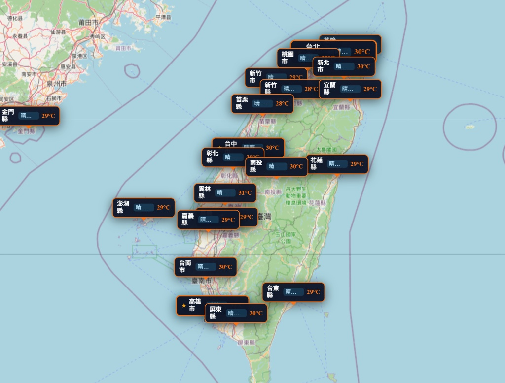

# 台灣即時氣象 GIS 互動地圖 (Taiwan Weather GIS)

## 🌐 線上作品展示 (Live Demo)

🔗 **即時展示網址**：[https://0921-temp.vercel.app](https://0921-temp.vercel.app)



---

## 🚀 專案簡介 (Overview)

本專案採用 **Next.js (App Router)**、**React-Leaflet** 與 **Tailwind CSS** 開發，整合**交通部中央氣象署 (CWA) 開放資料平臺 API**，提供全台各縣市 36 小時天氣預報與氣象觀測資料的視覺化 GIS 地圖平台。

### ✨ 主要功能特色
- 🗺️ **GIS 互動地圖**：全螢幕互動地圖，支援平移、縮放與免費 OpenStreetMap / 衛星底圖切換。
- 📍 **即時天氣大頭針**：標記全台 22 縣市即時天氣現象 (Wx)、溫度範圍與降雨機率。
- 📊 **36 小時天氣預報**：點擊各縣市大頭針可展開詳細的 36 小時時段預報抽屜。
- ⚡ **SSR 相容性優化**：透過 Next.js Dynamic Client-only Import 解決 Leaflet 地圖在伺服端渲染問題。
- 🛡️ **API 快取與降級機制**：伺服端智慧快取減輕 CWA API 請求負擔，並提供韌性備援機制。

---

## 🛠️ 技術堆疊 (Tech Stack)

- **前端框架**：Next.js 14 (App Router) + React 18 + TypeScript
- **地圖套件**：Leaflet + React-Leaflet
- **UI 與樣式**：Tailwind CSS + Lucide Icons + Glassmorphism 現代科技感設計
- **資料來源**：中央氣象署 (CWA) `F-C0032-001`、`O-A0003-001` 開放資料 API

---

## 💻 本地端快速啟動 (Getting Started)

### 1. 複製專案與安裝依賴

```bash
git clone https://github.com/meimei1000103-dotcom/0921Temp.git
cd 0921Temp
npm install
```

### 2. 設定環境變數

建立 `.env.local` 檔案並填入氣象署 API 授權碼：

```env
CWA_API_KEY=your_cwa_api_key_here
```

### 3. 啟動開發伺服器

```bash
npm run dev
```

開啟瀏覽器前往 [http://localhost:3000](http://localhost:3000) 即可檢視應用程式。

---

## 📝 授權說明 (License)

This project is open-source. Feel free to use and adapt it as needed.
