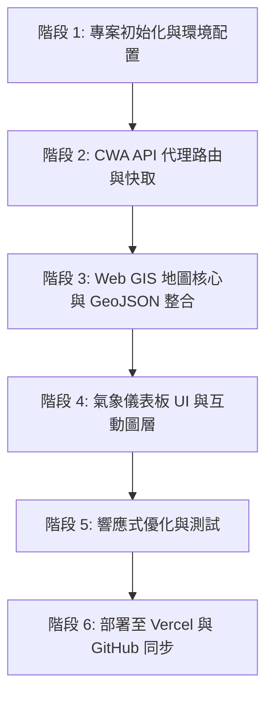

# 台灣氣象 GIS 資訊地圖 開發計畫 (plan.md)

本文件依據 [專案設計文件](file:///c:/Users/User/OneDrive/Desktop/0921Temp/project_design_document.md) 制定詳細開發與實作步驟。

---

## 🎯 專案目標

打造一個視覺精美、具現代感、響應式（RWD）的**台灣即時氣象 GIS 互動地圖 Web 應用程式**：
1. **地圖視覺化**：整合 Leaflet.js 互動地圖，展示全台 22 縣市及氣象觀測站即時氣象與天氣預報。
2. **CWA API 後端代理**：透過 Next.js API Routes (`/api/weather`) 安全轉發中央氣象署 API 請求，具備快取（Cache / ISR）機制與 API Key 保護。
3. **高質感 UI/UX**：採用現代毛玻璃（Glassmorphism）、深色/淺色主題支援、流暢微動畫與豐富氣象指標圖表（溫度、降雨機率、風速、濕度、紫外線等）。
4. **一鍵部署**：無縫支援 GitHub + Vercel 自動化 CI/CD 部署。

---

## 🏗️ 系統架構與技術選型

| 領域 | 技術選型 | 說明 |
| :--- | :--- | :--- |
| **框架 (Framework)** | **Next.js 14+ (App Router)** | 提供 React 伺服器端渲染、優化與 API Routes 支援 |
| **程式語言** | **TypeScript** | 提供完整的型別安全與 CWA API Response 型別定義 |
| **Web GIS 地圖** | **Leaflet.js + React-Leaflet** | 輕量且開源的地圖引擎，支援自訂 Marker、Popup、GeoJSON 縣市邊界層 |
| **樣式與主題** | **Tailwind CSS + Tailwind Animate** | 快速打造現代深色/科技感介面與自適應 RWD 佈局 |
| **圖示與視覺** | **Lucide React + Custom Weather Icons** | 豐富現代圖示庫 |
| **資料來源** | **中央氣象署 (CWA) Open API** | `F-C0032-001` (36小時天氣預報), `O-A0003-001` (即時觀測站資料) |

---

## 📅 實作里程碑與工作項目 (Roadmap)

---

### 🔹 階段 1：專案初始化與環境配置
- [ ] 透過 Next.js (TypeScript, Tailwind CSS, ESLint) 建立專案結構
- [ ] 安裝依賴套件：`leaflet`, `react-leaflet`, `@types/leaflet`, `lucide-react`, `clsx`, `tailwind-merge`
- [ ] 設定 `next.config.js` 與環境變數讀取 (`.env.local` / `.env`)
- [ ] 驗證 `.gitignore` 確保敏感資料不外洩

---

### 🔹 階段 2：CWA 氣象 API 代理服務
- [ ] 建立 Next.js API Route：`app/api/weather/route.ts`
- [ ] 串接 CWA API 端點：
  - `F-C0032-001`：全台 22 縣市 36 小時天氣預報（天氣現象 Wx、降雨機率 PoP、最低溫 MinT、最高溫 MaxT、舒適度 CI）
  - `O-A0003-001`：全台自動氣象站即時觀測資料（即時氣溫、風速、相對濕度、累積雨量）
- [ ] 實作 Server-side Cache 機制（快取 10~15 分鐘），避免超出 CWA Rate Limit
- [ ] 定義標準 TypeScript 介面與錯誤處理回退機制（Mock Data Fallback）

---

### 🔹 階段 3：Web GIS 台灣地圖核心開發
- [ ] 整合 Leaflet 台灣中心定位（緯度 `23.7`, 經度 `120.9`，預設 Zoom `7.5~8`）
- [ ] 載入台灣 22 縣市 GeoJSON 邊界圖層，提供懸停（Hover）高亮與點擊選取
- [ ] 解決 Next.js SSR 環境下 Leaflet `window is not defined` 問題（Dynamic Client-only Import）
- [ ] 客製化 Weather Marker（以溫度圓徽、天氣圖示呈現各縣市/測站即時狀態）

---

### 🔹 階段 4：現代化儀表板 UI 與互動功能
- [ ] **頂部/側邊導覽列**：搜尋縣市、切換「縣市預報 / 即時測站 / 降雨雷達」、深色/淺色主題
- [ ] **縣市氣象詳情面板 (Detail Drawer / Modal)**：
  - 36 小時逐 12 小時預報趨勢卡片
  - 降雨機率長條圖、高低溫區間
  - 穿衣與戶外活動建議指數
- [ ] **地圖圖層切換控制**：
  - 氣溫熱力分佈 / 縣市區塊填色
  - 降雨機率可視化
  - 衛星雲圖 / 雷達回波圖層切換 (可選 CWA WMS 或圖層)
- [ ] **即時更新與重新整理按鈕**（顯示最後更新時間）

---

### 🔹 階段 5：全面測試與效能優化
- [ ] 跨平台與行動裝置 RWD 測試（支援手機觸控手勢、底部滑動抽取卡片）
- [ ] API 網路錯誤與離線狀態優雅降級處理
- [ ] 靜態資源與 GIS 圖層效能優化

---

### 🔹 階段 6：版本控制與 Vercel 部署
- [ ] 提交所有程式碼並 Push 至 GitHub `main` 分支
- [ ] 於 Vercel 後台設定環境變數 `CWA_API_KEY`
- [ ] 驗證 Production 環境連線與即時資料載入正常

---

## 🔒 資安與最佳實踐
1. **API Key 保護**：所有對 CWA 的請求一律透過伺服器端 `/api/weather` 代理，前端不暴露授權碼。
2. **防護 Rate Limit**：伺服器端設置快取控制，減低 API 請求負載。
3. **乾淨架構**：邏輯層（Hooks/Services）與展示層（Components）明確分離。
